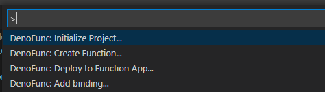

# `denofunc` extension for Visual Studio Code

This is VScode extension for using [`denofunc`](https://github.com/anthonychu/azure-functions-deno-worker) in VScode.

## Features
This extension adds the following commands to VScode.

  - Initialize your folder as `denofunc` project, equivalent to `denofunc init`
  - Create functions to your project based on [templates](https://github.com/horihiro/vscode-denofunc/blob/main/src/templates/index.ts) included in this extension
  - Deploy your project to Azure Functions, equivalent to `denofunc publish`

## Requirements

- [denofunc CLI](https://github.com/anthonychu/azure-functions-deno-worker#install-the-denofunc-cli) 0.6.0 or later
  - [Deno](https://deno.land/x/install@v0.1.4) 1.5.4 or later
  - [Azure Functions Core Tools V3](https://github.com/Azure/azure-functions-core-tools#azure-functions-core-tools) - needed for debugging the app locally and deploying it
  - [Azure CLI](https://docs.microsoft.com/cli/azure/install-azure-cli?view=azure-cli-latest#install) - needed to deploy the app

## Extension Settings

* `denofunc.path`: path of `denofunc` CLI (default: "`denofunc`")

## Known Issues

Calling out known issues can help limit users opening duplicate issues against your extension.

## Release Notes

Users appreciate release notes as you update your extension.

### 0.0.1

Alpha release.
